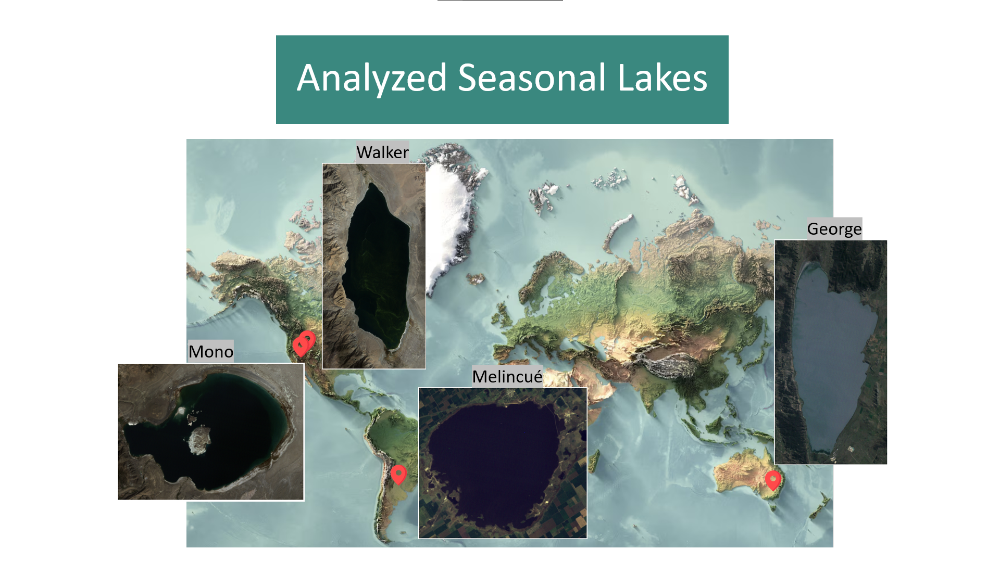
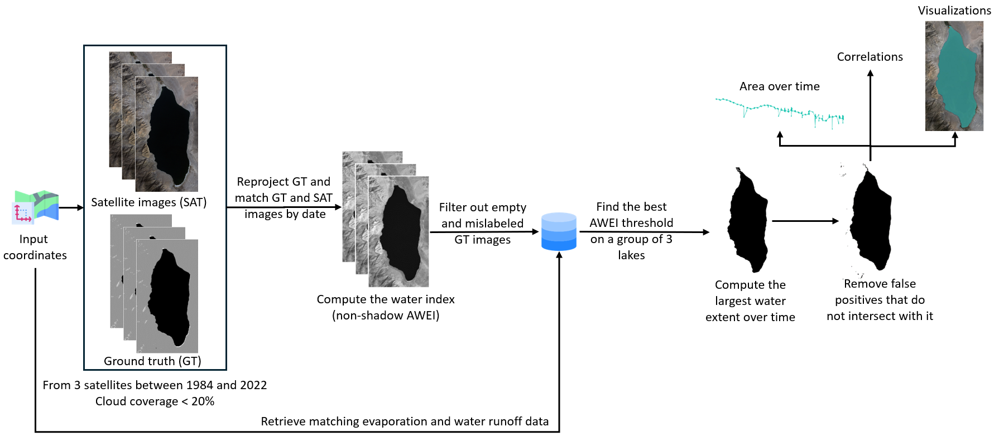
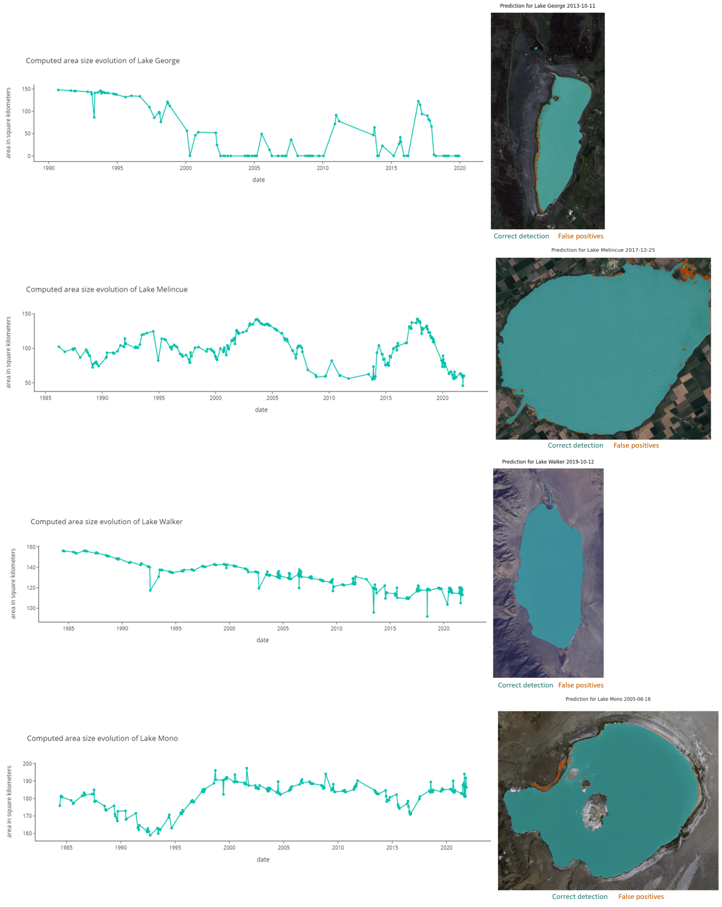

# Lakes-Analysis

### Analysis of seasonal lake area evolution from satellite images

Investigated four seasonal lakes: Walker, George, Mono, and Melincué.

Developed a threshold-based method using non-shadow AWEI and cross-validation to monitor seasonal lake area changes over 38 years of Landsat imagery and assess their relationship with ERA5-Land runoff and evaporation data.

Generated time series of lake area evolution and created animated visualizations highlighting accurate detections and false positives across all satellite images.

For more details, please refer to the [presentation](./presentation.pptx) and [report](./report.pdf).